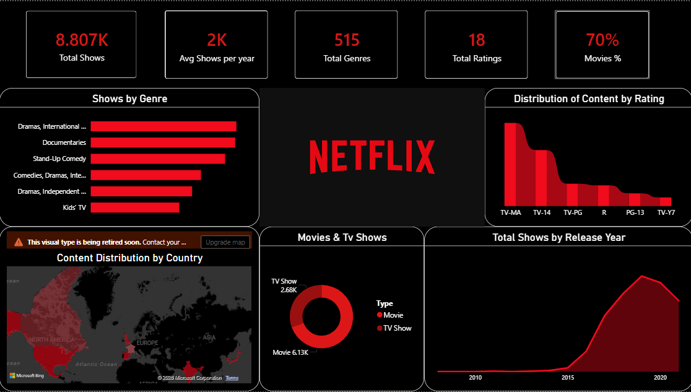

# Netflix Data Analysis Dashboard (Power BI)

## 📊 Overview
This project presents a Power BI dashboard analyzing Netflix content to uncover insights about genres, ratings, and content trends.

## 🔍 Key Insights
- Movies dominate Netflix content (~70%)
- Content growth increased significantly after 2015
- Drama and International genres are most popular
- Majority of content falls under TV-MA rating

## 🛠 Tools Used
- Power BI
- DAX
- Data Cleaning

## 📈 Features
- KPI metrics (Total Shows, Avg Shows per Year, Genres, Ratings)
- Genre distribution analysis
- Rating distribution
- Country-wise content distribution
- Trend analysis by release year

## 📷 Dashboard Preview

## 🚀 How to Use
Download the `.pbix` file and open in Power BI Desktop to explore the dashboard.
